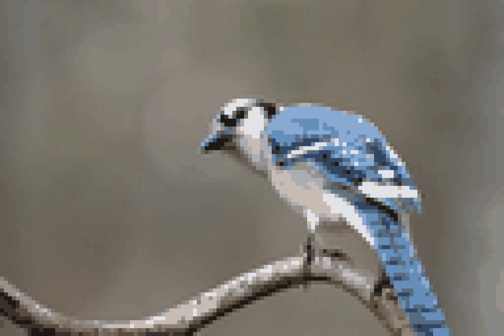
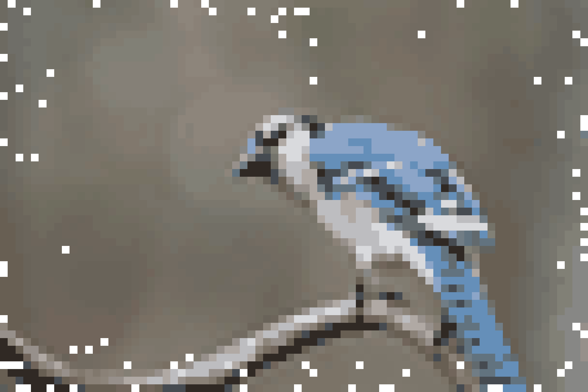

# Pixel Artify

[](https://www.python.org/downloads/)

A command-line tool written in Python to convert images into pixel art, with options for customization and effects.

This script takes an input image, downscales it to create larger "pixels", optionally reduces the color palette, and then scales it back up using nearest-neighbor interpolation. It can preserve transparency and add an optional "distressed edge" effect.

## Examples

**Pixelated `-p 15` `-c 75`** | **Pixelated & Distressed `-p 25` `-c 50` `-d 10`**
:-------------------------:|:-------------------------:
 | 

*(Example outputs based on processing an image with this tool. See the `examples` folder.)*

## Features

* **Pixelation:** Converts images into pixel art with adjustable block sizes.

* **Color Quantization:** Optionally reduces the number of colors in the output image.

* **Transparency Preservation:** Retains alpha channel transparency from the original image (PNG output recommended).

* **Distressed Edges:** Optionally adds a "chipped" edge effect to *originally opaque* images.

  * The effect is blocky, aligning with the chosen `pixel_size`.

  * The probability of a block being removed decreases further from the edge.

* **Default File Handling:**

  * Looks for input images in `./input_images/` by default.

  * Saves output images to `./output_images/` by default.

  * Generates output filenames as `pixel_<input_name>.png` by default.

  * **Auto-Suffixing:** Automatically adds `_N` (e.g., `_1`, `_2`) to default output filenames if the name already exists, preventing accidental overwrites.

* **Command-Line Interface:** Easy to use and scriptable.

* **Directory Creation:** Automatically creates the output directory if it doesn't exist.

## Requirements

* Python 3.6 or higher
* Pillow library (`pip install Pillow`)

## Setup

Follow these steps to set up the project and its dependencies using a virtual environment. It is recommended to use Git to clone the repository.

1. **Obtain the Code:**
    Clone the repository to your local machine using Git and navigate into the project directory:

    ```bash
    git clone https://github.com/marcusrprojects/pixel-artify.git
    cd pixel-artify
    ```

    Alternatively, download the source code (`pixel_artify.py` and any other necessary files) manually and navigate to the project directory in your terminal.

2. **Create Default Folders (Optional but Recommended):**
    Create the default input and output directories if they don't exist:

    ```bash
    mkdir input_images output_images examples
    ```

    *(Place your input images in `input_images` and example outputs in `examples`)*

3. **Create Virtual Environment:**
    Create a Python virtual environment named `.venv`:

    ```bash
    python -m venv .venv
    ```

    *(On some systems, you might need to use `python3` instead of `python`)*

4. **Activate Virtual Environment:**
    * **macOS / Linux:**

        ```bash
        source .venv/bin/activate
        ```

    * **Windows (Command Prompt):**

        ```bash
        .\.venv\Scripts\activate
        ```

    * **Windows (PowerShell):**

        ```bash
        .\.venv\Scripts\Activate.ps1
        ```

    You should see `(.venv)` at the beginning of your terminal prompt.

5. **Install Dependencies:**
    Install the required Pillow library:

    ```bash
    pip install Pillow
    ```

## Usage

Run the script from your terminal while the virtual environment is active.

**Basic Syntax:**

```bash
python pixel_artify.py <input_image> [options]
```

**Arguments:**

* `input_image_path`: Path to the image file you want to pixelate.
  * If just a filename (e.g., `photo.jpg`) is provided, the script looks in the directory specified by `--input-dir` (default: `input_images`).
  * If a full or relative path (e.g., `../images/photo.jpg`) is provided, it uses that path directly.

**Options:**

* `-o OUTPUT`, `--output OUTPUT`:

  * Specifies the exact full path for the output image file (e.g., `my_folder/custom_name.png`).

  * If this option is omitted, the script uses the default behavior:

    * Saves to the directory specified by `--output-dir` (default: `output_images`).

    * Names the file `pixel_<input_name>.png`.

    * If that filename already exists, it appends `_N` (e.g., `pixel_<input_name>_1.png`, `pixel_<input_name>_2.png`, etc.) to avoid overwriting.

* `--input-dir INPUT_DIR`:

  * Directory to search for the input image if `input_image` argument is just a filename.

  * Default: `input_images`

* `--output-dir OUTPUT_DIR`:

  * Directory where output files are saved when -o is not used.

  * Default: `output_images`

* `-p PIXEL_SIZE, --pixel_size PIXEL_SIZE`:

  * Sets the size of the pixel art blocks (e.g., 8 means each block is 8x8 original pixels).

  * Default: `8`

* `-c COLORS, --colors COLORS`:

  * Sets the maximum number of colors in the output image via quantization. (Optional)

  * e.g., `16` or `32`.

  * Default: None (no explicit color reduction beyond downscaling)

* `-d PERCENT, --distress-edges PERCENT`:

  * Adds a decaying "chipped edge" effect. `PERCENT` is the base chance (1-100) for edge blocks to be removed.

  * Requires saving as PNG (which is the default output format).

  * Example: `-d 25`

  * Default: `0` (no distress)

* `-h, --help`:

  * Show this help message and exit.

**Examples:**

1. **Basic Usage (Defaults):**
    * Place `my_photo.jpg` inside the `input_images` folder.
    * Run:

        ```bash
        python pixel_artify.py my_photo.jpg -p 16
        ```

    * Output: `output_images/pixel_my_photo.png` (with 16x16 pixel blocks). If it exists, the next run might create `output_images/pixel_my_photo_1.png`.

2. **Specify Output & Colors:**
    * Run:

        ```bash
        python pixel_artify.py input_images/landscape.png -c 32 -o artwork/pixel_landscape.png
        ```

    * Output: `artwork/pixel_landscape.png` (with default 8x8 blocks, max 32 colors).

3. **Distressed Edges Example:**
    * (Assuming `movie_poster.jpg` is in `input_images`)
    * Run:

        ```bash
        python pixel_artify.py movie_poster.jpg -p 25 -c 30 -d 40
        ```

    * Output: `output_images/pixel_movie_poster.png` (or `_1.png`, etc.) with 25x25 blocks, 30 colors, and distressed edges.

4. **Using Different Directories:**
    * Run:

        ```bash
        python pixel_artify.py title.png --input-dir assets/sprites --output-dir build/pixelated_sprites -p 4
        ```

    * Looks for `assets/sprites/title.png`.
    * Saves output as `build/pixelated_sprites/pixel_title.png` (using 4x4 blocks).

## Disclaimer

Users are responsible for ensuring they have the appropriate rights and permissions to process images with this tool. This tool is intended for educational and personal use only.
